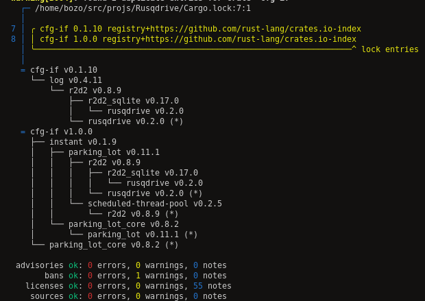

# Rusqdrive

[](https://deps.rs/repo/github/JADSN/Rusqdrive)

---

## Description

Implement:

- CREATE TABLE
- READ COUNT
- READ ALL
- INSERT ONE
- UPDATE ONE
- DELETE ONE

- **Pure Rust:** Written in pure Rust using zero unsafe code.

## Techs

- **rusqlite**: Ergonomic bindings to SQLite for Rust ([GitHub](https://github.com/rusqlite/rusqlite))
- **syn**: A parsing library for parsing a stream of Rust tokens into a syntax tree of Rust source code. ([GitHub](https://github.com/dtolnay/syn))
- **quote**: Provides the quote! macro for turning Rust syntax tree data structures into tokens of source code. ([GitHub](https://github.com/dtolnay/quote))
- **proc-macro2**: A wrapper around the procedural macro API of the compiler's proc_macro crate. ([GitHub](https://github.com/alexcrichton/proc-macro2))

## Usage

### 1. Imports

```rs

use rusqdrive::prelude::*;

```

### 2. Add `#[tablename = "tablename"]` and `Rusdrive` derive

```rs

#[tablename = "tablename"]
#[derive(Rusqdrive)]

```

### 3. Add  `#[rusqdrive(not_null = false, unique = false)]` attribute in all fields except `id`

```rs

#[rusqdrive(not_null = [true | false], unique = [true | false])]

```
### 4. Example - Look at `examples/usercrud`

```rs

#[tablename = "tablename"]
#[derive(Debug, Default, Rusqdrive)]
pub struct User {
    pub id: Option<i32>,
    #[rusqdrive(not_null = false, unique = false)]
    pub name: Option<String>,
    #[rusqdrive(not_null = false, unique = false)]
    pub age: f64,
    #[rusqdrive(not_null = false, unique = false)]
    pub alive: bool,
}

```

## 5.Cargo deny - Cargo plugin for linting your dependencies

``` make cargo-deny ```


## 6. Repos that helped me with derive code
1. [GetSet](https://github.com/Hoverbear/getset)
1. [Diesel](https://github.com/diesel-rs/diesel)
1. [Oxidizer](https://github.com/oxidizer-rs/oxidizer)
1. [Rocket](https://github.com/SergioBenitez/Rocket/tree/v0.4)
1. [Validator](https://github.com/Keats/validator)
2. [Sqlx](https://github.com/launchbadge/sqlx)

## 7. Run example

` make `